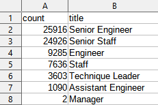
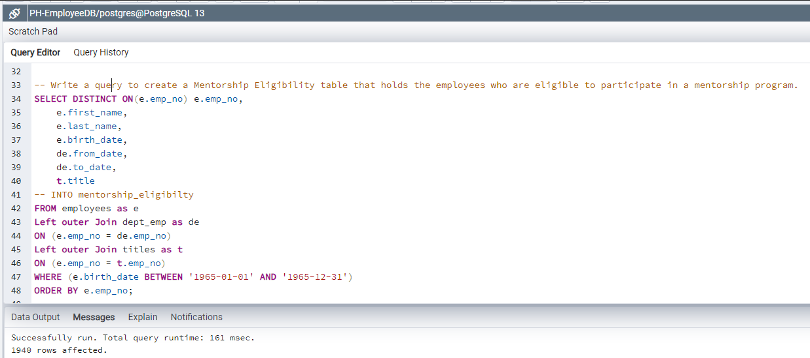

# Pewlett-Hackard-Analysis

## 1. Overview of the analysis 

Explain the purpose of this analysis:

In this project, we have been tasked to determine the number of retiring employees per title, and identify employees who are eligible to participate in a mentorship program. Then, we  will write a report that summarizes our analysis and helps prepare our associate's manager for the “silver tsunami” as many current employees reach retirement age.

## 2. Results 

Provide a bulleted list with four major points from the two analysis deliverables. Use images as support where needed:

    From the finding of the eligible retirees, a high percentage of the workforce could retire at any given time. 
    The following is the job titles of the eligible retirees, the breakdown is below.
    > * 25,916 Senior Engineers
    > * 24,926 Senior Staffs
    > * 9,285 Engineers
    > * 7,636 Staffs
    > * 3,603 Technique Leaders
    > * 1,090 Assistant Engineers
    > * 2 Managers

    Furthermore, the mentorship program is avaliable to some of these eligible retirees.
    The following is the amount of retirees eligble for the program.
    > * 1,940 eligble for mentorship program
    

## 3. Summary 
* Provide high-level responses to the following questions, then provide two additional queries or tables that may provide more insight into the upcoming "silver tsunami.":

    > **1)** How many roles will need to be filled as the "silver tsunami" begins to make an impact?.

    72,458 total employees are eligble to retire and the company needs to be prepared to fill these jobs at any given time.
     
    > **2)** Are there enough qualified, retirement-ready employees in the departments to mentor the next generation of Pewlett Hackard employees?  

    No, currently there are 1,940 employees who are eligible to participate in a mentorship program which would not meet the current amount of employees that would need to be hired. 